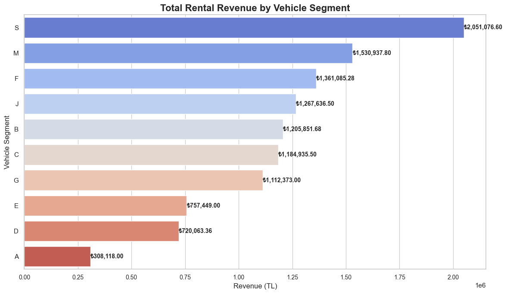

# SQL and Pandas Data Analysis Project

This repository contains SQL queries and data analysis scripts for working with car rental data using SQL and Python's pandas library.

## Project Structure

- `sorgular.sql`: Main SQL queries for data analysis
- `rental_insert.sql`: SQL insert statements for rental data
- `insert.sql`: Main insert statements 
- `sql_pandas.ipynb`: Jupyter notebook containing SQL Server connection and pandas 

## Prerequisites

- Python >= 3.x
- pandas
- Jupyter Notebook
- SQL Server Database

## Installation

1. Clone this repository:
```bash
git clone https://github.com/utku9012/sql_pandas.git
```

2. Install required packages using requirements.txt:
```bash
pip install -r requirements.txt
```

## Usage

### SQL Queries
The SQL files contain various queries for:
- Data insertion
- Data analysis
- Complex queries for car rental operations

### Python Analysis
The Python scripts and notebooks provide:
- Data visualization
- Data analysis using pandas
- Integration of SQL and pandas workflows

## Visualization Examples

### 1. Vehicle Brand Distribution
- Bar chart showing the distribution of vehicle brands
- Includes percentage and count for each brand

### 2. Vehicle Segment Analysis
- Pie chart showing the distribution of vehicle segments
- Provides insights into the most popular vehicle categories

### 3. Payment Methods Distribution
- Visual representation of different payment methods used
- Helps understand customer payment preferences

### 4. Total Rental Revenue by Vehicle Segment

- Analysis of revenue generation across different vehicle segments
- Helps identify the most profitable vehicle categories
